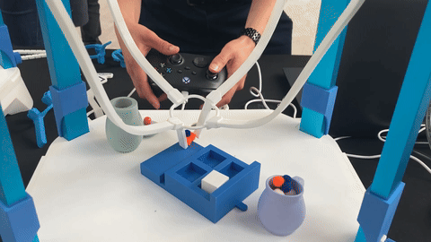
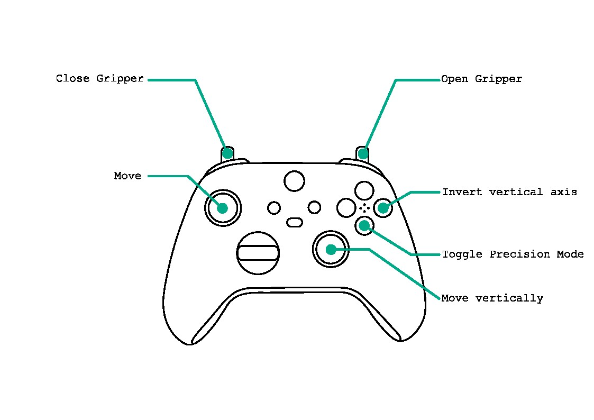

# Emio.Demo Gamepad

  

This demo shows how to use the `Sofa.GamepadController` module to control a SOFA simulation using a gamepad to move the gripper of Emio 
It uses the `inputs` Python package to handle gamepad events. Press the `A`button to toggle the precision mode. Left `Z` trigger closes the gripper and right `Z` trigger opens it. You can also click the `B` button to invert the vertical axis of the sticks.

You can add it into Emio Labs using the labs configurator.
